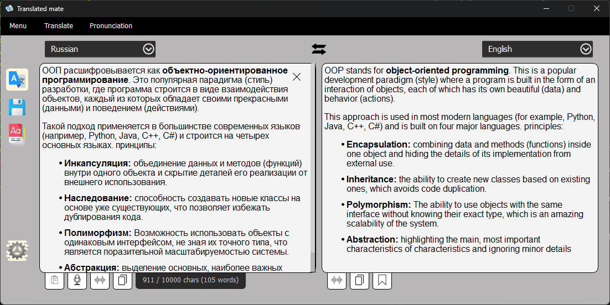

# Translated mate
# v0.4.5
## Description (Описание)

Переводчик с возможностью переводить текст на различные языки с одного на другой, используя разные модели переводчиков.

**Возможности:**

- Выбор переводчика:
    - Google (По умолчанию)
    - Deeple (Не стабильный)
- Кнопки:
    - Произношение текстов
    - Вставка текста из буфера обмена
    - Сохранение переведённого текста в БД
    - Сохранение переведённого текста в буфер обмена
Возможности:
- Перевод текста с одного языка на другой
- Сохранение форматирования переводимого текста
- Подсчёт кол-ва слов и символов в тексте


**В планах разработки на будущее:**
- Автоматическое определение исходного языка
- Кэш переводов
- Переработка дизайна сохранённых слов
- Добавление своих слов для тренировки
- Экспорт в Anki, csv и txt
- Flash карточки тренировки
- Ввод текста микрофоном
- Глобальные настройки программы
- Подгрузка обозначения слова
- Определение доступности сети Интернет
- Действия на сочетание клавиш

## Installation (Установка)

Установка зависимостей: `pip install -r requirements.txt`

Для конвертации XML-файла интерфейса при изменении UI, используется команда:

```bash
python -m PyQt6.uic.pyuic -x TranslateMate.ui -o ui/ui_main_window.py
```

## Visual appearance of the programme (Визуальный вид программы)
